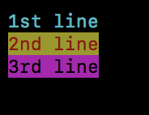
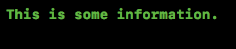
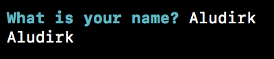

# Module - Message

Show color message in shell.

* [Constants](#constants)
* [message](#message)
* [info](#info)
* [error](#error)
* [question](#question)

## Constants

See [ANSI escape code#Colors](https://en.wikipedia.org/wiki/ANSI_escape_code#Colors).

Constants | Color
----- | -----
${COLOR_BLACK} | Black
${COLOR_RED} | Red
${COLOR_GREEN} | Green
${COLOR_YELLOW} | Yellow
${COLOR_BLUE} | Blue
${COLOR_MAGENTA} | Magenta
${COLOR_CYAN} | Cyan
${COLOR_WHITE} | White

## message

```
################################################################################
# Print message with color.
#
# Usage: message [-t] [-f color] [-b color] message
#
# Options:
#   -t       Bright text.
#   -f color Foreground color, use COLOR_*, default black.
#   -b color Background color, use COLOR_*, default no background.
#   -n       Do not print the trailing newline character.
#
# Parameters:
#   message [in] The message to print.
#
# Returns:
#   ${LIB_BASH_ERROR_INVALID_PARAM}
#   ${LIB_BASH_ERROR_INVALID_OPTION}
################################################################################
```

Examples:
```bash
message -f ${COLOR_CYAN} "1st line"
message -f ${COLOR_RED} -b ${COLOR_YELLOW} "2nd line"
message -f ${COLOR_BLACK} -b ${COLOR_MAGENTA} "3rd line"
```


```bash
message -f ${COLOR_CYAN} -n "one "
message -t -f ${COLOR_CYAN} -n "two "
message -f ${COLOR_RED} -n "three "
message -t -f ${COLOR_RED} -b ${COLOR_YELLOW} -n "four "
message -t -f ${COLOR_GREEN} -n "five"
```


## info

```
################################################################################
# Print information message.
#
# Usage: info <information>
#
# Parameters:
#   information [in] The information.
#
# Returns:
#   ${LIB_BASH_ERROR_INVALID_PARAM}
#
# The default color of the information message is green, and you can change it
# by setup ${LIB_BASH_INFO_COLOR}.
################################################################################
```

Example:
```bash
info "This is some information."
```


## error

```
################################################################################
# Print error message.
#
# Usage: error <error>
#
# Parameters:
#   error [in] The error message.
#
# Returns:
#   ${LIB_BASH_ERROR_INVALID_PARAM}
#
# The default colors of the error message is white/red (FG/BG), and you can
# change it by setup ${LIB_BASH_ERROR_FG} and ${LIB_BASH_ERROR_BG}.
################################################################################
```

Example:
```bash
error "FATAL ERROR"
```


## question

```
################################################################################
# Print question.
#
# Usage: question <question> <answer>
#
# Parameters:
#   question [in]  The question.
#   answer   [out] The answer.
#
# Returns:
#   ${LIB_BASH_ERROR_INVALID_PARAM}
#   ${LIB_BASH_ERROR_NO_OUTPUT}
#
# The default color of the questionis cyan, and you can change it by setup
# ${LIB_BASH_QUESTION_COLOR}.
################################################################################
```

Example:
```bash
question "What is your name? " name
printf "%s\n" "${name}"
```

